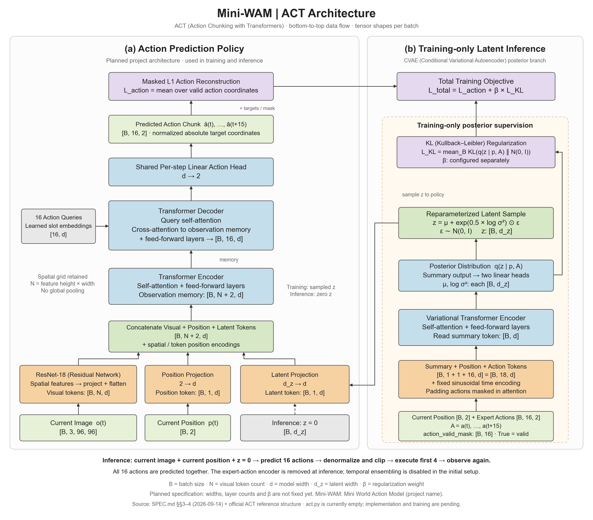
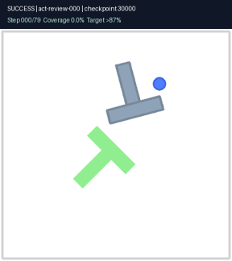
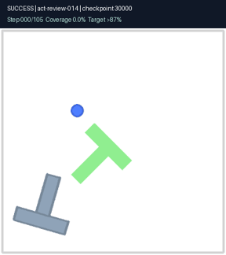
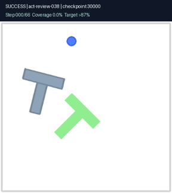
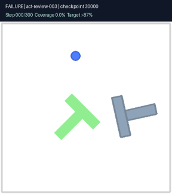
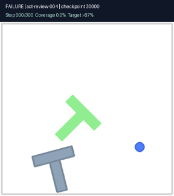
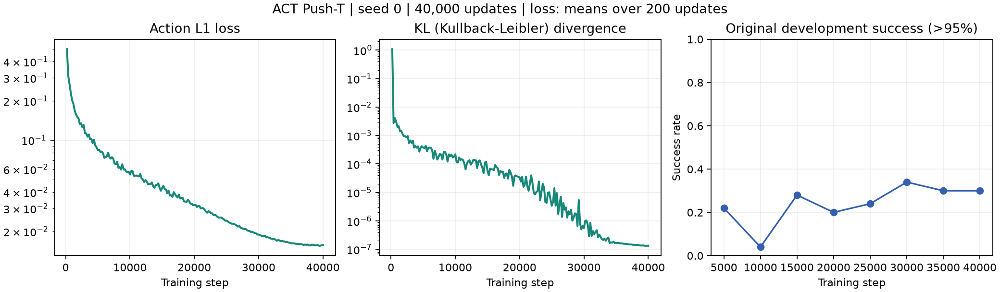

<h1>ACT · Push-T</h1>

从示范学习推动 T 形物体：模型实现、可恢复训练、闭环评测与交互演示。

<b>64% 成功率</b> · 50 个新场景 · 覆盖率 &gt;87% · 206 条示范 · 单训练种子

ACT（Action Chunking with Transformers，基于 Transformer 的动作分块）的独立学习与复现项目。输入当前图像和智能体二维位置，预测 16 步绝对目标动作；执行 4 步后重新观测。模型与训练核心由项目作者实现。

训练已完成 **40,000 步**。展示使用原开发场景选出的 **30,000 步检查点**。发布指标是对保存的全部评测轨迹按新阈值重算，**并非重新训练后取得的提升**。

## 架构概览

**动作预测主干：** ResNet-18（Residual Network，残差网络）从当前图像提取空间特征，与当前位置和潜变量一起送入 Transformer 编码器；16 个可学习动作查询通过解码器读取观测特征，一次预测 16 步二维目标坐标。执行前 4 步，再观察并重新规划。

**仅训练使用的潜变量分支：** CVAE（Conditional Variational Autoencoder，条件变分自编码器）根据当前位置与专家动作推断潜变量分布，用采样的 `z` 辅助动作重建，并施加 KL（Kullback–Leibler）正则。推理时移除专家动作输入，固定 `z=0`；尾部填充动作在注意力和重建损失中屏蔽。

图为早期设计原图，底部“尚未实现、参数未定”的状态文字已过时：当前模型已实现并完成训练，宽度 256、8 个注意力头、主干与后验编码器各 4 层、潜变量维度 32、正则权重 10。图中位置投影在代码中为两层网络，后验均值与对数方差由同一线性投影输出后拆分；其余以当前代码为准。

## 成功与失败视频

下列视频重放模型真实输出的动作，逐步验证覆盖率与原评测记录一致。成功视频在首次超过 87% 时停止；失败视频保留完整 300 步。动态预览按实际时间播放，点击预览打开视频文件。

<table>
<tr>
<th>成功 · 场景 000</th><th>成功 · 场景 014</th><th>成功 · 场景 038</th>
</tr>
<tr>
<td></td>
<td></td>
<td></td>
</tr>
<tr><td>原轨迹也达到 &gt;95%</td><td>达到 &gt;87%，但原轨迹结束时回落到 85.2%</td><td>较短的成功轨迹</td></tr>
<tr><th>失败 · 场景 003</th><th>失败 · 场景 004</th><th>可追溯的演示</th></tr>
<tr>
<td></td>
<td></td>
<td>固定场景编号与种子 检查点：30,000 步 逐步覆盖率校验 3 段成功 + 2 段失败 <a href="reports/act/release87/videos.json">视频证据清单</a></td>
</tr>
<tr><td>最高覆盖率 82.8%</td><td>最高覆盖率 0%</td><td>示例用于解释行为，不代替全量评测</td></tr>
</table>

GitHub 会过滤普通 HTML（HyperText Markup Language，超文本标记语言）`video` 标签，因此首页使用兼容的 HTML 表格、动态预览和视频链接。克隆后可打开 [视频播放器页面](docs/videos.html)，用原生播放器观看全部视频。

## 结果与口径

**成功：在最多 300 个环境步内，任意一步覆盖率严格大于 0.87；首次到达即停止。** 恰好 87% 不算成功。覆盖率表示目标区域被 T 形物体覆盖的比例。

| 检查点 | 发布成功率：曾 >87% | 原轨迹结束时 >87% | 原严格成功率：>95% |
|---|---:|---:|---:|
| **30,000** | **32/50 · 64%** | 29/50 · 58% | 21/50 · 42% |
| 35,000 | 31/50 · 62% | 27/50 · 54% | 14/50 · 28% |
| 40,000 | 31/50 · 62% | 29/50 · 58% | 18/50 · 36% |

30,000 步模型的 64% 成功率，Wilson 95% 置信区间为 **50.1%–75.9%**。一次训练、50 个场景不足以证明跨训练种子的稳定优势。新阈值为训练结束后的发布决定；原开发选点仍按 >95% 保留，未根据新阈值重新选择模型。不同训练数据和场景下的旧项目成绩不作为配对提升结论。

详见 [发布实验报告](reports/act/RELEASE_REPORT.md)、[87% 重算结果](reports/act/release87/summary.json)、[原始评测](reports/act/fresh50_20260918/REPORT.md)。原轨迹结束覆盖率不等同于按 87% 提前停止后的覆盖率。

## 训练过程

曲线来自完整的 40,000 行训练日志；损失按每 200 步平均绘制。开发场景曲线保留训练时的 >95% 标准。[完成标记](reports/act/training/completed.json)与[原选点记录](reports/act/training/selection.json)均已归档。

## 数据与模型

| 项目 | 本次配置 |
|---|---|
| 数据 | `lerobot/pusht_image`，206 回合，25,650 帧，25,444 个有效动作窗口 |
| 输入 | 当前 RGB（Red, Green, Blue，红绿蓝）图像 `[B,3,96,96]`、位置 `[B,2]` |
| 输出 | 16 步二维绝对目标坐标 `[B,16,2]`，每轮执行前 4 步 |
| 视觉与时序 | ResNet-18（Residual Network，残差网络）、Transformer 编解码器、固定时间位置编码 |
| 潜变量 | CVAE（Conditional Variational Autoencoder，条件变分自编码器）；推理 `z=0` |
| 损失 | 有效动作的 L1 重建损失 + 10 × KL（Kullback–Leibler）散度 |
| 训练 | 种子 0；批大小 64；40,000 次更新；NVIDIA L4 |

`B` 为批大小。尾部填充不参加动作损失。全部示范用于训练，开发与复核来自独立生成的模拟场景。[接口规格](SPEC.md)记录模型与数据契约。

## 项目导航

- `src/mini_wam/models/act.py`：模型；`training/act.py`：训练与恢复。
- `scripts/`：训练、评测、交互演示、证据重建与校验入口。
- `configs/`、`splits/`、`artifacts/act/`：配置、场景、全量数据审计。
- `reports/act/`：训练记录、逐回合结果、发布报告。
- `docs/media/`：真实轨迹视频、动态预览与训练曲线。

包名保留 `mini_wam`，部分旧辅助模块为共享导入依赖；本仓库发布目标仅为 ACT。

参考：[ACT 项目](https://tonyzhaozh.github.io/aloha/)、[作者实现](https://github.com/tonyzhaozh/act)、[数据集](https://huggingface.co/datasets/lerobot/pusht_image)。本项目为学习适配，不宣称复现原论文的机器人实验成绩。
